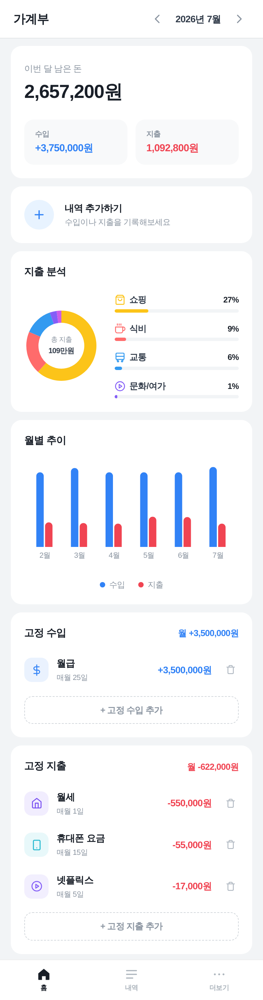
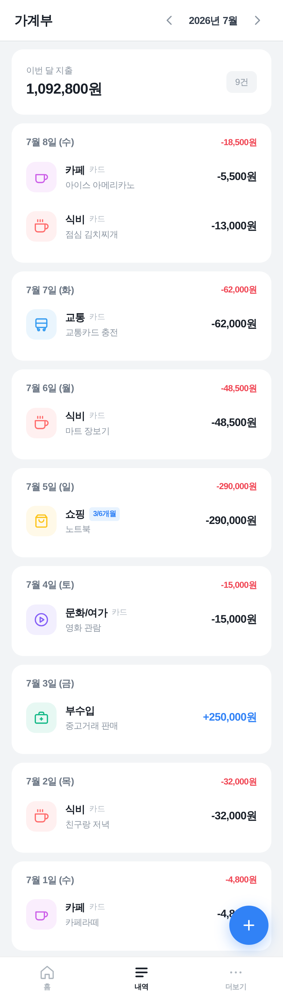
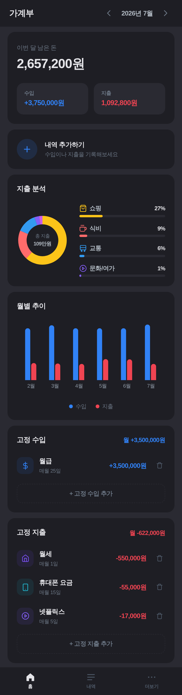

# 💰 가계부 (Monthly Expense)

> 토스 스타일의 깔끔한 가계부 웹 · 안드로이드 앱. 회원가입 없이, 내 데이터는 내 기기에만.

[](https://monthly-expense.pages.dev)


가입도, 서버도 없습니다. 모든 데이터는 브라우저(localStorage)에만 저장돼서 어디로도 전송되지 않아요. 그런데 대부분의 가계부 앱이 놓치는 **카드 할부 자동 분할**과 **고정 수입/지출** 관리를 제대로 지원합니다.

| 대시보드 | 내역 | 다크모드 |
|:---:|:---:|:---:|
|  |  |  |

## ✨ 이런 게 됩니다

- **수입/지출 관리** — 카테고리별 내역 기록
- **카드 할부 자동 분할** — 2~36개월 할부를 매달로 자동 배분 (다른 가계부엔 잘 없는 기능)
- **고정 수입/지출** — 급여·구독처럼 매월 반복되는 항목 자동 반영
- **대시보드** — 월간 요약 · 지출 파이차트 · 월별 추이 바차트
- **다크모드** — 시스템 / 라이트 / 다크
- **데이터 이동** — JSON 내보내기/가져오기 (기기 바꿔도 그대로)
- **웹 + 안드로이드** — 브라우저에서 바로 쓰거나 Capacitor로 APK 빌드
- **모바일 퍼스트** — 폰에서 쓰기 좋은 UI

## 🔒 프라이버시

계정·로그인·트래킹 없음. 데이터는 전부 기기 로컬에만 저장됩니다. 서버로 아무것도 보내지 않아요. 백업이 필요하면 JSON으로 직접 내보내세요.

## 🚀 시작하기

```bash
git clone https://github.com/jungdev24/monthly-expense.git
cd monthly-expense
npm install
npm run dev
```

브라우저에서 `http://localhost:5173` 접속.

### 프로덕션 빌드

```bash
npm run build
```

### 안드로이드 앱 빌드

```bash
npm run build
npx cap sync android
npx cap open android   # Android Studio에서 APK 빌드
```

### 배포 (Cloudflare Pages)

```bash
npm run build
npx wrangler pages deploy dist --project-name monthly-expense
```

## 🛠 기술 스택

React 19 · TypeScript · Vite 6 · Tailwind CSS v4 · Recharts · date-fns · Capacitor (Android)

## 🤝 기여

이슈와 PR 환영합니다. 버그 제보, 기능 제안, UI 개선 등 무엇이든 편하게 남겨주세요.

## 📄 라이선스

[MIT](LICENSE) © 2026 jungdev24
